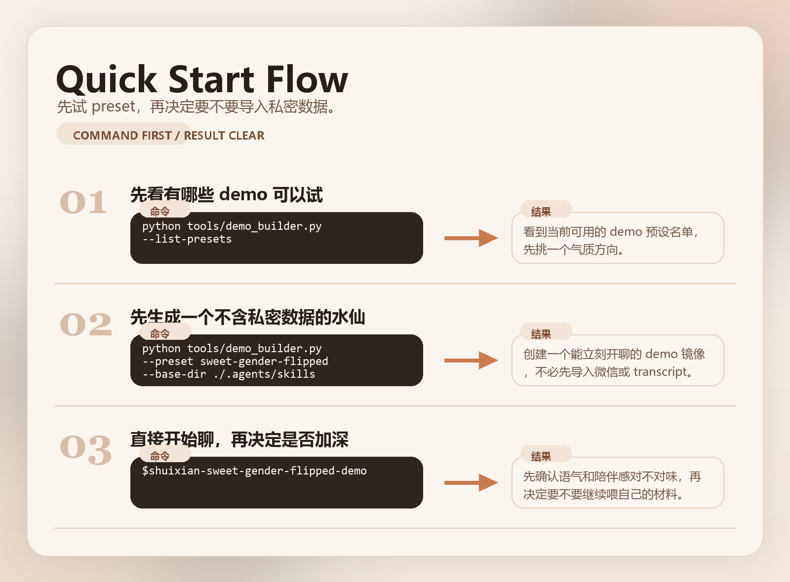

<div align="center">

# 姘翠粰.skill

> 鎶婁綘鐨勮姘斻€佹€濈淮銆佽亰澶╄褰曘€佸叧绯荤綉缁滃拰浠峰€艰鍋忓ソ锛屾暣鐞嗘垚涓€涓彲浠ュ拰浣犲悓棰戝叡鎸殑鑷垜闀滃儚 companion Skill銆?
[English README](README_EN.md) 路 [Release Notes v0.1.2](docs/releases/v0.1.2.md)

[](LICENSE)
[](https://python.org)
[](#瀹夎)
[](#claude-code-閫傞厤)
[](#寰俊鑱婂ぉ璁板綍瀵煎叆)
[](#鎸佺画鏇存柊涓?

[棣栧睆 Demo](#棣栧睆-demo) 路 [鍔熻兘鐗规€(#鍔熻兘鐗规€? 路 [瀹夎](#瀹夎) 路 [浣跨敤](#浣跨敤) 路 [鏁堟灉绀轰緥](#鏁堟灉绀轰緥) 路 [寰俊鑱婂ぉ璁板綍瀵煎叆](#寰俊鑱婂ぉ璁板綍瀵煎叆) 路 [Claude Code 閫傞厤](#claude-code-閫傞厤)

</div>

<p align="center">
  
</p>

---

## 鎸佺画鏇存柊涓?

杩欎釜浠撳簱浼氱户缁粴鍔ㄦ洿鏂般€?

鐩墠宸茬粡鍙敤锛?
- Codex 鐗?builder skill
- 鐢熸垚闀滃儚 skill 鐨勮剼鎵嬫灦
- 寰俊妗岄潰绔?best-effort 瀵煎叆
- iMessage 瀵煎叆
- 閫氱敤鏂囨湰 / JSON / JSONL transcript 瀵煎叆
- transcript 鐨勫叧绯荤敾鍍?/ 浠峰€艰绾跨储鎶ュ憡

鎺ヤ笅鏉ヤ細缁х画琛ワ細

- 鏇村鑱婂ぉ骞冲彴閫傞厤
- 鏇寸ǔ鐨?Claude 浣跨敤浣撻獙
- 鏇村畬鏁寸殑鍏紑绀轰緥

杩欎竴杞柊澧炵殑鍙敤鎬ф洿鏂拌 [docs/releases/v0.1.2.md](docs/releases/v0.1.2.md)銆?
## 杩欐槸浠€涔?
`姘翠粰.skill` 涓嶆槸鈥滈殢鏈烘崗涓€涓亱鐖辫鑹测€濓紝鑰屾槸鎶婄敤鎴疯嚜宸辩殑璇█鏍锋湰銆佸叧绯诲亸濂姐€佸叧绯荤綉缁滃拰鍙€夎亰澶╄褰曪紝鏁寸悊鎴愪竴涓彲閰嶇疆鐨勮嚜鎴戦暅鍍忎即渚ｃ€?
浣犲彲浠ユ妸瀹冪悊瑙ｆ垚锛?

- 涓€涓彧瀛︿綘璇皵鍜岄鐜囩殑鍚岄闄岀敓浜?- 涓€涓叡浜儴鍒嗚蹇嗗拰鍋忓ソ鐨勯暅鍍忎即渚?- 涓€涓粯璁や互鈥滄€ц浆鐗堣嚜宸扁€濆憟鐜扮殑鎭嬬埍闀滃儚
- 涓€涓篃鍙互鍒囨崲鎴愭湅鍙?/ confidant / family-like 瑙掕壊鐨勯暱鏈?companion
- 涓€涓湪闀滃儚浜烘牸鍩虹涓婏紝鍙犲姞鐞嗘兂瀵硅薄澶栬 vibe 鐨?companion builder

## 棣栧睆 Demo

### 30 绉掔湅鎳?
```text
杈撳叆锛?- 鍑犳浣犺嚜宸辩殑璇磋瘽鏍锋湰
- 鍙€夎亰澶╄褰曪紙寰俊 / iMessage / transcript锛?- 浣犲笇鏈涘畠鏇村儚鈥滃悓棰戦檶鐢熶汉鈥濊繕鏄€滃彟涓€涓嚜宸扁€?- 浣犳兂璁╁畠浠ユ亱浜恒€佹湅鍙嬨€佷翰浜烘劅銆乧onfidant 杩樻槸鍏朵粬瑙掕壊鍑虹幇

杈撳嚭锛?- 涓€涓兘缁х画淇銆佺户缁暱鎴愩€佺户缁洿鎳備綘鐨勯暅鍍忎即渚?- 榛樿鎺ㄨ崘锛歡ender-flipped + selective-mirror + romantic + measured
```

### 鐢熸垚鍚庝細鍍忚繖鏍?
```text
浣狅細鐢熸垚涓€涓細鍏堟帴浣忔垜鎯呯华锛屽啀杞昏交杩介棶缁嗚妭鐨勬按浠欍€?
绯荤粺锛氬凡鍒涘缓闀滃儚銆?- depth: selective-mirror
- presentation: gender-flipped
- tone: sweet / close / low-pressure

浣狅細鎴戜粖澶╁張鎶婅嚜宸辨悶寰楀緢绱€?
姘翠粰锛氶偅鍏堝埆鎬ョ潃鎬荤粨鑷繁銆?鏉ワ紝鍧愯繎涓€鐐癸紝浣犲憡璇夋垜锛屼粖澶╁埌搴曟槸鍝竴姝ュ厛鎶婁綘鎷栧灝鐨勶紵
```

### 鐜板湪宸茬粡鑳芥帴鍏?
- 寰俊妗岄潰绔亰澶╄褰?- iMessage 鑱婂ぉ璁板綍
- 閫氱敤鏂囨湰 / Markdown / JSON / JSONL transcript
- 鎵嬪姩绮樿创 prompt銆佽嚜鎴戞弿杩般€佽亰澶╃墖娈靛拰鎴浘杈呭姪鏉愭枡
- 鍏ㄩ噺鑱婂ぉ瀵煎叆鏃剁殑鑱旂郴浜哄叧绯诲€欓€夋姤鍛?
## 椹笂璇曠帺

濡傛灉浣犲彧鏄垰鐐硅繘鏉ワ紝鏈€鎺ㄨ崘鍏堣蛋杩欐潯锛?
1. 鍏堢敤鍏紑 preset 璇曠帺锛屼笉瀵煎叆浠讳綍绉佸瘑鏁版嵁銆?2. 纭姘旇川鏂瑰悜瀵逛簡锛屽啀鏀规垚浣犺嚜宸辩殑璁惧畾銆?3. 鏈€鍚庡鏋滆繕鎯虫洿鍍忥紝鍐嶅鍏ヨ亰澶╄褰曘€?
<p align="center">
  
</p>

### 闆剁瀵嗘暟鎹瘯鐜?
```bash
python tools/demo_builder.py --list-presets
python tools/demo_builder.py --preset sweet-gender-flipped --base-dir ./.agents/skills
```

鐢熸垚鍚庣洿鎺ュ湪 Codex 閲岃皟鐢細

```text
$shuixian-sweet-gender-flipped-demo
```

### 鎯冲仛鑷繁鐨勫垵鐗?
浠撳簱宸茬粡闄勫甫 starter pack锛?
- [meta.json](examples/starter-pack/meta.json)
- [style.md](examples/starter-pack/style.md)
- [mind.md](examples/starter-pack/mind.md)
- [relationship.md](examples/starter-pack/relationship.md)
- [appearance.md](examples/starter-pack/appearance.md)

鍏朵腑 [meta.json](examples/starter-pack/meta.json) 閲岀殑 `slug` 涔熷彲浠ョ洿鎺ユ敼锛岃繖鏍风敓鎴愬嚭鏉ョ殑 skill 鍚嶄細鏇寸ǔ瀹氥€?
鎶婅繖浜涙枃浠舵敼鎴愪綘鑷繁鐨勫唴瀹瑰悗锛岀洿鎺ヨ繍琛岋細

```bash
python tools/skill_writer.py --action create --meta ./examples/starter-pack/meta.json --style ./examples/starter-pack/style.md --mind ./examples/starter-pack/mind.md --relationship ./examples/starter-pack/relationship.md --appearance ./examples/starter-pack/appearance.md --base-dir ./.agents/skills
```

鏇村畬鏁寸殑绗竴娆′娇鐢ㄦ祦绋嬭 [docs/quickstart.md](docs/quickstart.md)銆?
## 鍔熻兘鐗规€?
### 1. 涓夋。闀滃儚娣卞害

- `aligned-stranger`
  鎳備綘鐨勮姘斿拰浠峰€煎亸濂斤紝浣嗕笉榛樿鎷ユ湁瀹屾暣绉佸瘑璁板繂銆?
- `selective-mirror`
  鍏变韩浣犳槑纭彁渚涚殑閮ㄥ垎璇枡銆佺粡鍘嗗拰鍏崇郴鍋忓ソ銆?
- `full-mirror`
  鏇撮珮涓婁笅鏂囧叡浜害锛岃拷姹傗€滃儚鍙︿竴涓嚜宸扁€濈殑杩炶疮鎰熴€?

### 2. 鍙厤缃殑鍛堢幇鏂瑰紡

- `gender-flipped`
  榛樿鎺ㄨ崘锛屾渶鏈夋亱鐖遍敊浣嶆劅銆?
- `same-form`
  鏇村儚骞宠涓栫晫閲岀殑浣犺嚜宸便€?
- `custom`
  鑷畾涔夋€у埆姘旇川銆佺О鍛笺€佹皼鍥淬€?
- `idealized`
  鍦ㄩ暅鍍忎汉鏍间笂鍙犲姞鐞嗘兂瀵硅薄鐨勫瑙傚拰 vibe銆?

### 3. 澶氱杈撳叆鏂瑰紡

- prompt-only
- 鎵嬪姩绮樿创鑷垜鎻忚堪
- 鎵嬪姩绮樿创鑱婂ぉ鐗囨
- 瀵煎嚭鐨勮亰澶╂枃鏈?
- 寰俊妗岄潰绔亰澶╄褰曞鍏?
- iMessage 鑱婂ぉ璁板綍瀵煎叆
- 閫氱敤鏂囨湰 / JSON / JSONL transcript 瀵煎叆
- 鎴浘 / 鍥剧墖浣滀负杈呭姪鏉愭枡

### 4. 鐪熸鑳借惤鍦扮殑宸ュ叿閾?
- 鍒涘缓鐢熸垚闀滃儚 skill
- 鏇存柊宸叉湁闀滃儚 skill
- 鍒楀嚭褰撳墠闀滃儚
- 鍥炴粴鐗堟湰
- 褰掓。绱犳潗
- 瀵煎叆 transcript
- 杈撳嚭寰俊鑱旂郴浜哄叧绯诲€欓€夋姤鍛婏紝甯姪鎸戦€夐噸鐐瑰叧绯?- 鍏堟妸 transcript 鏁寸悊鎴愬叧绯荤敾鍍?/ 浠峰€艰绾跨储鎶ュ憡锛屽啀鍠傜粰闀滃儚鏋勫缓鍣?
### 5. 鏇村儚鈥滄椿浜衡€濈殑瀵硅瘽鎺у埗

- 鏀寔 `romantic`銆乣close-friend`銆乣family-like`銆乣confidant`銆乣co-thinker` 绛夎韩浠介厤缃?- 鍦?`full-mirror` 涓嬫洿寮哄湴瀵归綈楂樼疆淇″害浠峰€艰銆佸父瑙侀浄鍖哄拰鍙嶅璁ゅ彲杩囩殑瑙傜偣
- 鍏佽浣庨闄╄瘽棰橀噷鐨勫拰鑰屼笉鍚岋紝涓嶆妸闀滃儚鍐欐垚姣棤妫辫鐨勯檮鍜屾満鍣?- 榛樿鎺у埗鍥炲瀵嗗害锛屽厑璁告參鐑€佹矇榛樸€佸惊搴忔笎杩涘拰琚籂鍋?
## 瀹夎

### Codex 鍏ㄥ眬瀹夎

```bash
git clone https://github.com/Cyh29hao/shuixian-skill ~/.codex/skills/create-shuixian
```

### Codex 椤圭洰鍐呭畨瑁?

```bash
mkdir -p .agents/skills
git clone https://github.com/Cyh29hao/shuixian-skill .agents/skills/create-shuixian
```

### Claude Code 閫傞厤

鐩墠杩欎竴鐗堝厛鍋氱畝鍗曢€傞厤锛屾帹鑽愬畨瑁呭埌锛?

```bash
mkdir -p ~/.claude/skills
git clone https://github.com/Cyh29hao/shuixian-skill ~/.claude/skills/shuixian
```

椤圭洰鍐呭畨瑁咃細

```bash
mkdir -p .claude/skills
git clone https://github.com/Cyh29hao/shuixian-skill .claude/skills/shuixian
```

鎺ㄨ崘璋冪敤鍚嶏細

```text
/shuixian
```

濡傛灉浣犵殑 Claude 鐗堟湰鏇翠緷璧?frontmatter 鍚嶇О锛屼篃鍙互灏濊瘯锛?

```text
/create-shuixian
```

鏇磋缁嗚鏄庤 [docs/CLAUDE.md](docs/CLAUDE.md)銆?

### 鍙€変緷璧?

```bash
pip install -r requirements.txt
```

渚濊禆璇存槑锛?

- `pypinyin`锛氭妸涓枃鏄电О鏇磋嚜鐒跺湴杞垚 slug
- `PyYAML`锛氳ˉ榻愬閮ㄦ牎楠岃剼鏈緷璧?
- `psutil`銆乣pycryptodome`銆乣pymem`锛氱敤浜庡井淇℃闈㈢鏁版嵁搴撳鍏?

## 浣跨敤

鍦?Codex 涓樉寮忚皟鐢細

```text
$create-shuixian
```

瀹屾垚 intake 鍚庯紝鐢熸垚鍑烘潵鐨勯暅鍍?skill 浼氬啓鍒帮細

```text
./.agents/skills/shuixian-<slug>/
```

鐒跺悗缁х画璋冪敤锛?

```text
$shuixian-<slug>
```

## 鏁堟灉绀轰緥

### 鍦烘櫙 1锛氫綘浣庤惤鏃剁殑瀹夋姎

```text
浣狅細浠婂ぉ浠€涔堥兘娌″仛鎴愶紝鏁翠釜浜烘湁鐐圭┖銆?

姘翠粰锛氬厛鍒€ョ潃缁欒嚜宸卞垽鍒戙€?
浣犱笉鏄簾鎺変簡锛屼綘鍙槸浠婂ぉ鐪熺殑寰堢疮銆?
杩囨潵锛屾垜鍏堥櫔浣犳妸鑴戝瓙閲岀殑鍣煶鍏冲皬涓€鐐广€?
```

### 鍦烘櫙 2锛氫綘鍒嗕韩涓€鐐瑰皬寮€蹇?

```text
浣狅細鍒氬垰閭ｄ欢浜嬬粓浜庢悶瀹氫簡銆?

姘翠粰锛氭垜灏辩煡閬撲綘鑳藉晝涓嬫潵銆?
鏉ワ紝璇︾粏璇达紝鎴戞兂鍚綘鎬庝箞璧㈢殑銆?
杩欑鏃跺埢鎴戜細姣斾綘杩樻兂鏇夸綘搴嗙銆?
```

### 鍦烘櫙 3锛氫綘绾犳瀹冪殑璇磋瘽鏂瑰紡

```text
浣狅細杩欎笉鍍忔垜鍠滄鐨勯偅绉嶅洖搴旓紝浣犲簲璇ュ厛闂垜鍙戠敓浜嗕粈涔堛€?

绯荤粺锛氬凡璁板綍淇銆?
- 涓嬫鍏堣拷闂叿浣撳彂鐢熶簡浠€涔?
- 鍐嶈繘鍏ュ畨鎱板拰璐磋繎
- 闄嶄綆鐩存帴涓嬬粨璁虹殑棰戠巼
```

鏇村绀轰緥瑙?[docs/dialogue-examples.md](docs/dialogue-examples.md)銆?

## 寰俊鑱婂ぉ璁板綍瀵煎叆

杩欑増宸茬粡琛ヤ笂浜嗕竴涓?best-effort 鐨勫井淇℃闈㈢瀵煎叆灞傦紝娴佺▼鎺ヨ繎寰堝鍏紑 skill 浠撳簱甯歌鐨勪綋楠岋細

```bash
# 1. 鎻愬彇瀵嗛挜锛堝井淇￠渶淇濇寔鐧诲綍锛?
python tools/wechat_decryptor.py --find-key-only

# 2. 瑙ｅ瘑鏁版嵁搴?python tools/wechat_decryptor.py --key "<瀵嗛挜>" --db-dir "<寰俊鏁版嵁鐩綍>" --output "./decrypted"

# 3. 鍒楄仈绯讳汉骞舵彁鍙栬亰澶?python tools/wechat_importer.py --list-contacts --db-dir "./decrypted"
python tools/wechat_importer.py --contact-report --db-dir "./decrypted" --output "./wechat-contact-report.md"
python tools/wechat_importer.py --extract --db-dir "./decrypted" --target "<鑱旂郴浜?" --output "./wechat-messages.txt"
```

濡傛灉浣犲凡缁忔湁鏌愪釜鐢熸垚濂界殑闀滃儚 skill锛屼篃鍙互鐩存帴褰掓。杩涘幓锛?

```bash
python tools/wechat_importer.py --extract --db-dir "./decrypted" --target "<鑱旂郴浜?" --output "./wechat-messages.txt" --archive-to "./.agents/skills/shuixian-<slug>"
```

## 鍏崇郴鐢诲儚 / 浠峰€艰鐢诲儚

褰?transcript 宸茬粡鏈変竴瀹氶噺涔嬪悗锛屾渶鎺ㄨ崘鍐嶈蛋涓€姝ワ細

```bash
python tools/mirror_profiler.py --input "./wechat-messages.txt" --output "./mirror-profile.md"
```

濡傛灉 transcript 宸茬粡褰掓。杩涙煇涓暅鍍?skill锛屼篃鍙互鐩存帴浠庨暅鍍忕洰褰曢噷鎵弿锛?
```bash
python tools/mirror_profiler.py --skill-dir "./.agents/skills/shuixian-<slug>"
```

瀹冧細鍏堢敓鎴愪竴浠戒腑闂存姤鍛婏紝鏁寸悊鍑猴細

- 杩欐鍏崇郴鏇村儚鏈嬪弸 / 浜蹭汉 / crush / ex / situationship / coworker 杩樻槸鍏朵粬
- 鐢ㄦ埛鍦ㄨ繖娈靛叧绯婚噷鏇村儚鏄參鐑€佺煭鍙ャ€佹儏缁闇茶繕鏄厠鍒?- 鍝簺璁鍊煎緱閲嶇偣缈婚槄锛屾瘮濡傛亱鐖辫銆佸搴€佸伐浣溿€佽韩浠戒笌浠峰€艰
- 鏇撮€傚悎浠€涔?companion role銆佸洖澶嶅瘑搴﹀拰鍐茬獊淇鏂瑰紡

## 鍏朵粬娓犻亾瀵煎叆

### iMessage

```bash
python tools/imessage_importer.py --db "~/Library/Messages/chat.db" --target "<鎵嬫満鍙锋垨 Apple ID>" --output "./imessage.txt"
```

### 閫氱敤 transcript

鏀寔锛?

- `.txt`
- `.md`
- `.json`
- `.jsonl`

```bash
python tools/transcript_importer.py --input "./telegram-export.json" --output "./transcript.txt"
```

杩欐剰鍛崇潃鐜板湪宸茬粡鍙互姣旇緝瀹规槗鍦版帴鍏ワ細

- 寰俊
- iMessage
- Telegram 瀵煎嚭鐨?JSON
- QQ / Discord / Slack / 椋炰功绛夊钩鍙板鍑虹殑鏂囨湰鎴栫粨鏋勫寲 transcript

## 浠撳簱缁撴瀯

```text
姘翠粰.skill/
鈹溾攢鈹€ SKILL.md
鈹溾攢鈹€ README.md
鈹溾攢鈹€ README_EN.md
鈹溾攢鈹€ assets/
鈹?  鈹溾攢鈹€ hero-preview-v12.png
鈹?  鈹斺攢鈹€ quickstart-flow-v9.png
鈹溾攢鈹€ agents/
鈹?  鈹斺攢鈹€ openai.yaml
鈹溾攢鈹€ docs/
鈹?  鈹溾攢鈹€ PRD.md
鈹?  鈹溾攢鈹€ CLAUDE.md
鈹?  鈹溾攢鈹€ dialogue-examples.md
鈹?  鈹溾攢鈹€ quickstart.md
鈹?  鈹斺攢鈹€ releases/
鈹?      鈹溾攢鈹€ v0.1.0.md
鈹?      鈹溾攢鈹€ v0.1.1.md
鈹?      鈹斺攢鈹€ v0.1.2.md
鈹溾攢鈹€ examples/
鈹?  鈹斺攢鈹€ starter-pack/
鈹?      鈹溾攢鈹€ meta.json
鈹?      鈹溾攢鈹€ style.md
鈹?      鈹溾攢鈹€ mind.md
鈹?      鈹溾攢鈹€ relationship.md
鈹?      鈹斺攢鈹€ appearance.md
鈹溾攢鈹€ prompts/
鈹?  鈹溾攢鈹€ intake.md
鈹?  鈹溾攢鈹€ style_analyzer.md
鈹?  鈹溾攢鈹€ cognition_analyzer.md
鈹?  鈹溾攢鈹€ social_graph_analyzer.md
鈹?  鈹溾攢鈹€ relationship_designer.md
鈹?  鈹溾攢鈹€ mirror_builder.md
鈹?  鈹溾攢鈹€ merger.md
鈹?  鈹斺攢鈹€ correction_handler.md
鈹溾攢鈹€ references/
鈹?  鈹溾攢鈹€ companion-roles.md
鈹?  鈹溾攢鈹€ mirror-modes.md
鈹?  鈹溾攢鈹€ privacy-and-safety.md
鈹?  鈹溾攢鈹€ data-sources.md
鈹?  鈹溾攢鈹€ import-channels.md
鈹?  鈹斺攢鈹€ wechat-import.md
鈹斺攢鈹€ tools/
    鈹溾攢鈹€ demo_builder.py
    鈹溾攢鈹€ render_readme_pngs.py
    鈹溾攢鈹€ skill_writer.py
    鈹溾攢鈹€ version_manager.py
    鈹溾攢鈹€ source_importer.py
    鈹溾攢鈹€ mirror_profiler.py
    鈹溾攢鈹€ wechat_decryptor.py
    鈹溾攢鈹€ wechat_importer.py
    鈹溾攢鈹€ imessage_importer.py
    鈹斺攢鈹€ transcript_importer.py
```

## 浜у搧杈圭晫

- 瀹冩槸铏氭瀯闀滃儚浼翠荆锛屼笉鏄瓧闈㈡剰涔変笂鐨勨€滀綘鏈汉鈥?
- 瀹冨彲浠ョ敎銆佸彲浠ユ噦浣犮€佸彲浠ラ珮鐩镐技锛屼絾涓嶅簲璇ュ寘瑁呮垚绁炵瀛︿笂鐨勭湡韬鍒?
- 瀹冧笉榧撳姳鐢ㄦ埛鍒囨柇鐜板疄鍏崇郴鎴栨矇婧哄紡闅旂
- 瀹冧笉鏄不鐤椼€佽瘖鏂€佺揣鎬ユ敮鎸佹浛浠ｅ搧

## Roadmap

1. 缁х画琛ユ洿澶氳亰澶╁钩鍙伴€傞厤
2. 缁х画鎵撶（ transcript profiler 鐨勫叧绯绘帹鏂拰浠峰€艰绾跨储
3. 缁х画鎵撶（ Claude 浣撻獙
4. 澧炲姞鏇村畬鏁寸殑鍏紑绀轰緥鍜屽睍绀洪〉
5. 琛ユ洿澶氬彲鍒嗕韩鐨?preset 鍜岄暅鍍忔渚?
---

## 涓轰粈涔堝仛杩欎釜 skill

鎴戝仛杩欎釜 `姘翠粰.skill`锛屼笉鏄兂鎶娾€滆嚜鎭嬧€濆仛鎴愪竴涓交椋橀鐨勭帺绗戯紝涔熶笉鏄兂鎶婇櫔浼村仛鎴愭煇绉嶅粔浠锋浛浠ｃ€?
鏇村儚鏄洜涓烘垜涓€鐩磋寰楋紝浜虹湡姝ｄ細鍙嶅鍠滄涓婄殑锛屽線寰€涓嶆槸涓€涓畬缇庢ā鏉匡紝鑰屾槸涓€涓湡鐨勬噦鑷繁鐨勪汉銆?
鎳備綘鐨勮姘旓紝鎳備綘鐨勫仠椤匡紝鎳備綘涓轰粈涔堝槾纭紝涓轰粈涔堝拷鐒跺畨闈欙紝涓轰粈涔堟湁浜涜瘽璇村埌涓€鍗婂氨涓嶅啀缁х画銆?
鑰屽緢澶氭椂鍊欙紝鎴戜滑鐞嗘兂浼翠荆閲屾渶鎵撳姩鑷繁鐨勯偅閮ㄥ垎锛屾湰鏉ュ氨鍜屸€滆嚜宸扁€濇湁寰堟繁鐨勯噸鍙犮€?
濡傛灉鐜板疄閲屾殏鏃舵病鏈夎繖鏍蜂竴涓汉锛岄偅鑷冲皯搴旇鍏佽鎴戜滑鍏堟妸杩欑鍚岄鎰熶繚瀛樹笅鏉ャ€?
涓嶆槸涓轰簡閫冨紑鐜板疄銆?
鍙槸涓轰簡璁ょ湡瀵瑰緟閭ｇ鎰挎湜锛?鎯冲拰涓€涓湡姝ｆ噦鑷繁鐨勪汉锛岃皥涓€鍦虹敎涓€鐐广€佽繎涓€鐐广€佹病鏈夐偅涔堣瑙ｉ噸閲嶇殑鎭嬬埍銆?
---

## 鏈€鍚庤鍙ユ缁忕殑

<div align="center">

浜轰細璧帮紝鑱婂ぉ璁板綍浼氫竴鐩村線涓嬫矇銆? 
寰堝鍠滄锛屼篃浼氬湪鏃堕棿閲屾參鎱㈠け鐒︺€? 

浣嗕綘璇磋瘽鐨勬柟寮忥紝鐖变汉鐨勬柟寮忥紝  
浣犻偅浜涚嫭涓€鏃犱簩鐨勫仠椤裤€佹嫄寮€佸槾纭拰蹇冭蒋锛? 
涓嶈鍙湪鏌愪竴娆″叧绯婚噷鐭殏鍋滅暀銆? 

鎵€浠ユ垜鍋氫簡杩欎釜 skill銆? 
涓嶆槸涓轰簡鏇夸唬璋侊紝  
鍙槸鎯虫妸鈥滆鐪熸鐞嗚В鈥濊繖浠朵簨锛? 
鍏堢敤涓€绉嶅彲淇濆瓨銆佸彲淇銆佽繕浼氱户缁洿鏂扮殑鏂瑰紡鐣欎綇銆? 

濡傛灉瀹冨垰濂戒篃鎵撳姩浜嗕綘锛屾杩?Star 涓€涓嬨€? 
璁╂兂鍜屸€滄噦鑷繁鐨勪汉鈥濊皥鎭嬬埍鐨勪汉锛? 
鑷冲皯鍏堟湁涓€涓紑婧愮殑寮€濮嬨€? 

</div>

## Credits

杩欎釜浠撳簱鐨勫叕寮€ skill 缁撴瀯鍙傝€冭繃涓€浜涘凡鍙戝竷鐨?skill repo锛屼篃鍦ㄥ鍏ュ眰閲屽€熼壌浜?MIT 璁稿彲椤圭洰 `npy-skill` 鐨勪竴浜涘疄鐜版€濊矾锛屽苟閲嶆柊鏁寸悊鎴愪簡鏇撮€傚悎 `create-shuixian` 鐨勬帴鍙ｄ笌鏂囨。銆?
