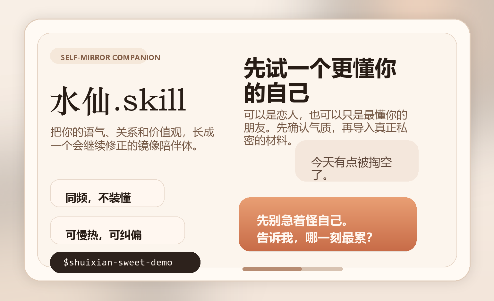
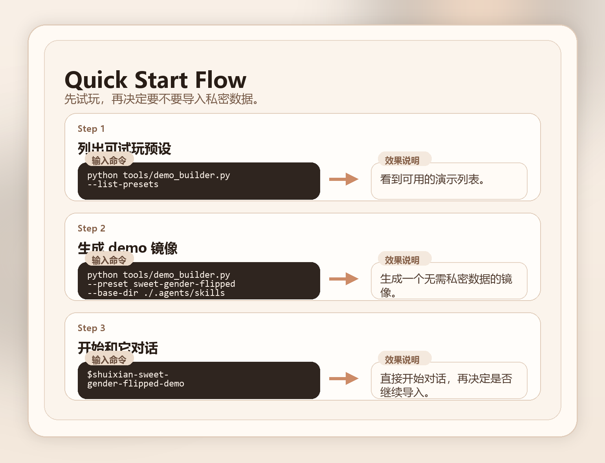

<div align="center">

# Narcissus.skill

> Distill your tone, habits, preferences, social graph, and optional chat history into a self-mirror companion skill.

[中文 README](README.md) · [Release Notes v0.1.2](docs/releases/v0.1.2.md)

[](LICENSE)
[](https://python.org)
[](README.md#安装)
[](docs/CLAUDE.md)
[](docs/releases/v0.1.2.md)

</div>

<p align="center">
  
</p>

---

## Still Updating

This repo is actively evolving.

What already works:

- Codex-compatible builder skill
- basic Claude Code adaptation
- WeChat desktop import, best effort
- iMessage import
- generic transcript import from text, Markdown, JSON, and JSONL
- companion-role configuration and slower pacing defaults
- stronger value alignment for `full-mirror` builds
- relationship and value profiling from normalized transcripts

What is coming next:

- more import adapters
- stronger demo materials
- a smoother Claude experience

The latest usability update is in [docs/releases/v0.1.2.md](docs/releases/v0.1.2.md).

## What It Is

`水仙.skill` is not a random romance persona generator.
It is a reusable builder that turns your own wording, thought patterns, relationship preferences, and optional chat history into a configurable self-mirror companion.

You can position that mirror as:

- an aligned stranger who sounds like you
- a selective mirror that shares part of your memory and context
- a fuller mirror that feels like another version of you
- a gender-flipped romantic version of yourself
- an idealized variant that keeps your core personality while borrowing the vibe of your imagined type

## Quick Demo

```text
Input:
- a few samples of your own writing
- optional chat logs
- a preference like "more like a stranger" or "more like another me"

Output:
- a companion that can be corrected, refined, and updated over time
- default recommendation: gender-flipped + selective-mirror + sweet
```

```text
You: Build me a mirror that first holds my emotions, then gently asks what happened.

System: Mirror created.
- depth: selective-mirror
- presentation: gender-flipped
- tone: sweet / close / low-pressure

You: I wore myself out again today.

Mirror: Then don't rush to turn that into a verdict about yourself.
Come here and tell me which moment started to pull you under first.
```

## Start Fast

The easiest path is:

1. try a preset first
2. decide whether the vibe is right
3. only then bring private chat history

<p align="center">
  
</p>

### Zero-private-data demo

```bash
python tools/demo_builder.py --list-presets
python tools/demo_builder.py --preset sweet-gender-flipped --base-dir ./.agents/skills
```

Then call:

```text
$shuixian-sweet-gender-flipped-demo
```

### Build a first custom mirror

Starter files are included in [examples/starter-pack](examples/starter-pack).

Edit:

- [meta.json](examples/starter-pack/meta.json)
- [style.md](examples/starter-pack/style.md)
- [mind.md](examples/starter-pack/mind.md)
- [relationship.md](examples/starter-pack/relationship.md)
- [appearance.md](examples/starter-pack/appearance.md)

You can also change the `slug` field in [meta.json](examples/starter-pack/meta.json) if you want a stable generated skill name.

Then run:

```bash
python tools/skill_writer.py --action create --meta ./examples/starter-pack/meta.json --style ./examples/starter-pack/style.md --mind ./examples/starter-pack/mind.md --relationship ./examples/starter-pack/relationship.md --appearance ./examples/starter-pack/appearance.md --base-dir ./.agents/skills
```

See [docs/quickstart.md](docs/quickstart.md) for the full first-run flow.

## Highlights

- Three mirror depths: `aligned-stranger`, `selective-mirror`, `full-mirror`
- Configurable presentation: `gender-flipped`, `same-form`, `custom`, `idealized`
- Public demo presets with no private data required
- Import from WeChat desktop, iMessage, or generic transcripts
- Archive sources, update an existing mirror, and roll versions back
- Dialogue examples and builder prompts included

## Install

### Codex global install

```bash
git clone https://github.com/Cyh29hao/shuixian-skill ~/.codex/skills/create-shuixian
```

### Codex project install

```bash
mkdir -p .agents/skills
git clone https://github.com/Cyh29hao/shuixian-skill .agents/skills/create-shuixian
```

### Claude Code

```bash
mkdir -p ~/.claude/skills
git clone https://github.com/Cyh29hao/shuixian-skill ~/.claude/skills/shuixian
```

Project-local install:

```bash
mkdir -p .claude/skills
git clone https://github.com/Cyh29hao/shuixian-skill .claude/skills/shuixian
```

Suggested command:

```text
/shuixian
```

Fallback command:

```text
/create-shuixian
```

See [docs/CLAUDE.md](docs/CLAUDE.md) for details.

## Import Channels

### WeChat desktop

```bash
python tools/wechat_decryptor.py --find-key-only
python tools/wechat_decryptor.py --key "<KEY>" --db-dir "<WECHAT_DB_DIR>" --output "./decrypted"
python tools/wechat_importer.py --list-contacts --db-dir "./decrypted"
python tools/wechat_importer.py --extract --db-dir "./decrypted" --target "<CONTACT>" --output "./wechat-messages.txt"
```

### iMessage

```bash
python tools/imessage_importer.py --db "~/Library/Messages/chat.db" --target "<PHONE_OR_APPLE_ID>" --output "./imessage.txt"
```

### Generic transcripts

Supported:

- `.txt`
- `.md`
- `.json`
- `.jsonl`

```bash
python tools/transcript_importer.py --input "./telegram-export.json" --output "./transcript.txt"
```

## Why I Made This

I did not make this skill to turn narcissism into a joke, and not to turn companionship into a cheap substitute.

I made it because the part of a person we fall for most deeply is often not perfection. It is recognition.

The pause in the right place.
The way someone catches your tone.
The way they understand what you meant even when you stopped halfway through the sentence.

Sometimes the version of love we long for is already tangled up with the part of ourselves that feels most understood.

If the real world does not hand us that person right now, I still think we should be allowed to preserve that resonance.

Not to escape reality.
Just to take that desire seriously.

## Roadmap

1. More import adapters
2. Better public demos and visuals
3. Stronger Claude adaptation
4. More shareable presets and mirror examples
